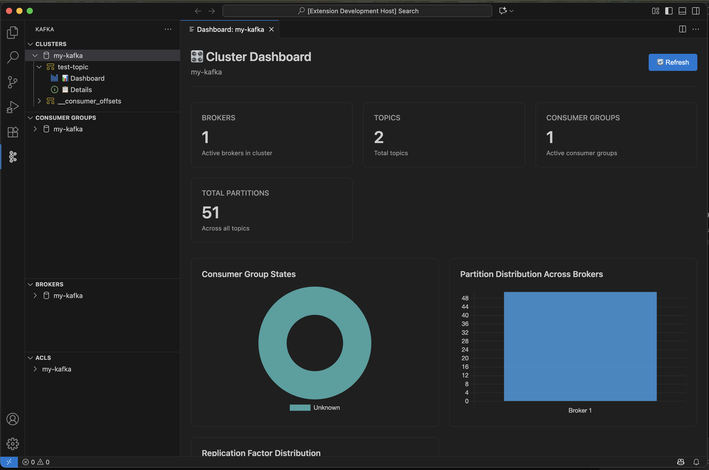
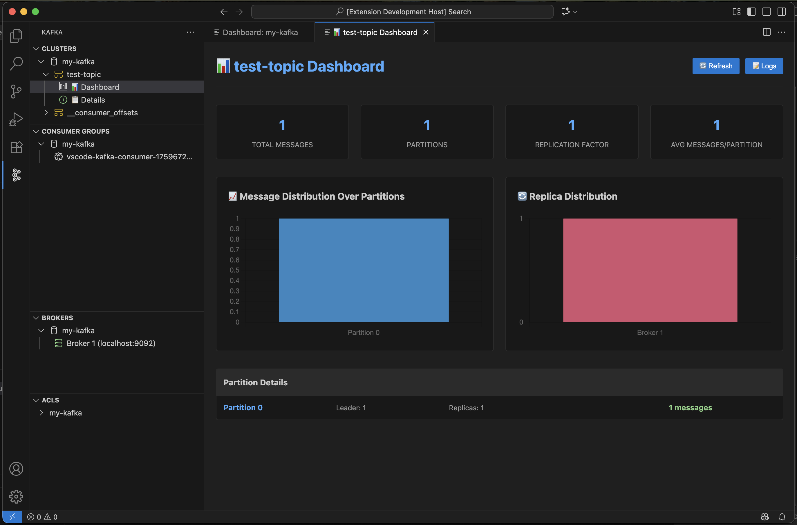

# Kafka Client for VSCode

[](https://github.com/nipunap/vscode-kafka-client/actions/workflows/ci.yml)
[](https://github.com/nipunap/vscode-kafka-client/releases/latest)
[](https://marketplace.visualstudio.com/items?itemName=NipunaPerera.vscode-kafka-client)
[](https://marketplace.visualstudio.com/items?itemName=NipunaPerera.vscode-kafka-client)
[](LICENSE)

A comprehensive Kafka management extension for Visual Studio Code with full AWS MSK support, ACL management, and enterprise-grade features.

## ✨ Features

- 🤖 **AI-Powered Advisor** - Get intelligent recommendations for topics, brokers, and consumer groups using GitHub Copilot
- 🔌 **Multi-Cluster Management** - Apache Kafka and AWS MSK with IAM authentication
- ☁️ **AWS Integration** - Auto-discovery, profile management, role assumption, credential tracking
- 🛡️ **ACL Management** - View, create, delete access control lists integrated with topics
- 📋 **Topic Operations** - Create, delete, produce, consume with rich HTML detail views
- 🌊 **Kafka Streams** - Dedicated views for KStreams and KTables with pattern-based filtering
- 🖥️ **Broker Monitoring** - Rich detail views with all configurations and metadata
- 👥 **Consumer Groups** - Color-coded health status, lag tracking, detailed HTML views
- 📊 **Rich Detail Views** - Interactive HTML panels with search (Cmd+F), copy as JSON, and AI recommendations
- 🔐 **Security** - Multiple auth methods (SSL/TLS, SASL, AWS IAM), secure credential storage
- 🔍 **Smart Search** - Find resources across clusters with fuzzy matching
- ⚡ **Performance** - Connection pooling and optimized data fetching

## 📸 Screenshots

### Cluster Dashboard
View real-time cluster metrics, broker information, partition distribution, and consumer group states.



### Topic Dashboard
Explore topic details with message distribution, replica distribution, and partition-level information.



## 📦 Installation

### From Marketplace
Search for "Kafka Client" in VSCode Extensions

### From VSIX
1. Download `.vsix` from [releases](https://github.com/nipunap/vscode-kafka-client/releases)
2. VSCode: `Extensions` → `⋯` → `Install from VSIX...`

### From Source
```bash
git clone https://github.com/nipunap/vscode-kafka-client.git
cd vscode-kafka-client
npm install
npm run compile
# Press F5 to launch Extension Development Host
```

## 🚀 Quick Start

### Apache Kafka

1. Click Kafka icon in Activity Bar
2. Click **"+"** button
3. Configure:
   - **Cluster Type**: Apache Kafka
   - **Connection Name**: my-kafka-cluster
   - **Bootstrap Servers**: `localhost:9092`
   - **Security Protocol**: PLAINTEXT, SSL, SASL_PLAINTEXT, or SASL_SSL
4. Click **Connect**

### AWS MSK with IAM

**Prerequisites:**
- AWS credentials in `~/.aws/credentials`
- IAM permissions: `kafka:ListClusters`, `kafka:GetBootstrapBrokers`

**Steps:**
1. Click **"+"** → **AWS MSK** → **IAM**
2. Select AWS Profile (view credential expiration: 🟢 Active, 🟡 Expiring, 🔴 Expired)
3. (Optional) Enable "Assume IAM Role" for elevated permissions
4. Select Region → **Discover Clusters** → Select your cluster
5. Click **Connect** ✅

### AWS MSK with TLS

Even simpler - no client certificates needed for standard TLS:
1. **Authentication Method**: TLS
2. Choose AWS Profile and Region
3. **Discover Clusters** → Select cluster
4. **Done!** (Client certificates only required for mutual TLS)

## 🔐 Authentication & Security

### Supported Methods

| Method | Apache Kafka | AWS MSK |
|--------|--------------|---------|
| PLAINTEXT | ✅ | ✅ |
| SSL/TLS | ✅ | ✅ |
| SASL/PLAIN | ✅ | ✅ |
| SASL/SCRAM-SHA-256 | ✅ | ✅ |
| SASL/SCRAM-SHA-512 | ✅ | ✅ |
| AWS IAM | - | ✅ |
| AWS Role Assumption | - | ✅ |

### AWS MSK IAM Setup

AWS MSK uses two-level authentication:

1. **AWS API Access** (base profile) - List clusters, get brokers
   ```json
   {
     "Effect": "Allow",
     "Action": [
       "kafka:ListClusters",
       "kafka:GetBootstrapBrokers"
     ],
     "Resource": "*"
   }
   ```

2. **Kafka Operations** (assumed role or base profile) - Topic/group operations
   ```json
   {
     "Effect": "Allow",
     "Action": [
       "kafka-cluster:Connect",
       "kafka-cluster:DescribeCluster",
       "kafka-cluster:*Topic*",
       "kafka-cluster:*Group*",
       "kafka-cluster:ReadData",
       "kafka-cluster:WriteData"
     ],
     "Resource": [
       "arn:aws:kafka:region:account:cluster/*",
       "arn:aws:kafka:region:account:topic/*/*",
       "arn:aws:kafka:region:account:group/*/*"
     ]
   }
   ```

3. **Role Assumption** (if using separate admin role)
   ```json
   {
     "Effect": "Allow",
     "Action": "sts:AssumeRole",
     "Resource": "arn:aws:iam::account:role/KafkaAdminRole"
   }
   ```

**Credentials Setup:**
```ini
# ~/.aws/credentials

[default]
aws_access_key_id = AKIA...
aws_secret_access_key = ...

[production]
aws_access_key_id = ASIA...
aws_secret_access_key = ...
aws_session_token = ...
x_security_token_expires = 2025-10-01T15:30:00Z
```

## 🛡️ ACL Management

View and manage Kafka Access Control Lists integrated directly with topics.

### Features
- 🔗 **Topic Integration** - ACLs displayed directly under topics for better context
- 📋 **View ACLs** - Browse topic-specific ACLs with rich HTML formatting
- 📊 **Dashboard Display** - Topic dashboards show ACL permissions with visual indicators
- ➕ **Create ACLs** - Interactive CLI command generation
- ❌ **Delete ACLs** - Safe removal with command preview
- 📚 **Interactive Help** - Rich HTML documentation with examples

### Required Permissions

**Read-Only Access:**
```bash
kafka-acls --add \
  --allow-principal User:your-user \
  --operation Describe --cluster

kafka-acls --add \
  --allow-principal User:your-user \
  --operation Describe --topic '*'
```

**Full Access:**
```bash
kafka-acls --add \
  --allow-principal User:your-user \
  --operation All --cluster

kafka-acls --add \
  --allow-principal User:your-user \
  --operation All --topic '*'
```

**Check Your Permissions:**
```bash
kafka-acls --list --principal User:your-user
```

## 📚 Usage

### 🤖 AI-Powered Recommendations

**Requirements**: VS Code 1.85+ and active GitHub Copilot subscription

Get intelligent, context-aware recommendations for your Kafka resources in a **concise, structured format**:

- **Topics**: Click 🤖 AI Advisor in topic details → Get configuration, performance, and reliability recommendations
- **Brokers**: Click 🤖 AI Advisor in broker details → Get JVM, network, security, and monitoring guidance
- **Consumer Groups**: Click 🤖 AI Advisor → Get lag analysis, scaling, and optimization suggestions

**Response Format** (structured and scannable):
- **Status**: One-line health assessment
- **Critical Issues**: Blocking problems (or "None identified")
- **Quick Wins**: 2-3 high-impact improvements with specific values
- **Performance/Security/Monitoring**: Resource-specific optimizations
- Each bullet point is ONE LINE with specific numbers and settings

**What AI Analyzes**:
- Configuration best practices
- Performance bottlenecks
- Security vulnerabilities
- Resource optimization
- Capacity planning
- Industry standards

**User Experience**:
- Button only appears when Copilot is active (smart availability detection)
- Response time: 5-15 seconds
- Beautiful formatting with headers, bullets, code blocks
- Searchable with Cmd+F / Ctrl+F
- Export recommendations as JSON

**Privacy**: Only configuration metadata is sent to AI. No credentials, passwords, or auth tokens ever leave your machine.

### Topics
- **Create**: Right-click cluster → "Create Topic"
- **View Details**: Click topic → Rich HTML view with partitions, offsets, configurations, and AI recommendations
- **Produce**: Right-click → "Produce Message" → Enter key/value
- **Consume**: Right-click → "Consume Messages" → From Beginning/Latest
- **Delete**: Right-click → "Delete Topic" (requires confirmation)
- **Search**: Use Cmd+F / Ctrl+F in detail view to find configurations
- **Export**: Click "Copy as JSON" to export all details

### Kafka Streams & Tables
- **KStreams View**: Shows topics matching stream patterns (`-stream-`, `KSTREAM`, `-repartition`)
- **KTables View**: Shows topics matching table patterns (`-changelog`, `-ktable-`, `-state-`)
- **Same Operations**: Produce, consume, view details like regular topics
- **Smart Filtering**: Automatically categorizes topics based on naming conventions

### Brokers
- **View Details**: Click broker → Rich HTML view with all configurations, metadata, and AI advisor
- **Search**: Find brokers by ID or host across clusters
- **Export**: Copy configurations as JSON

### Consumer Groups
- **Visual Status**: 🟢 Active | 🟠 Empty | 🔴 Dead/Rebalancing
- **View Details**: Click group → HTML view with members, offsets, lag, and AI recommendations
- **Delete**: Right-click → "Delete Consumer Group"
- **Reset Offsets**: Right-click → "Reset Offsets" (group must be empty)
- **Lag Tracking**: See total lag and per-partition breakdown

### ACLs
- **Integrated View**: ACLs are displayed under each topic in the Clusters view
- **Topic-Specific**: Expand any topic → Click "🔒 ACLs" to view permissions for that topic
- **Rich Details**: Click ACL → See formatted details in HTML with resource, principal, operation, and permission type
- **Create**: Right-click cluster → "Create ACL" → Copy CLI command
- **Delete**: Right-click ACL → "Delete ACL" → Copy CLI command
- **Help**: Right-click ACL container → "ACL Help" for interactive documentation

### Cluster Dashboard
- Right-click cluster → "Show Cluster Dashboard"
- View real-time metrics, partition distribution charts, top topics, broker info
- Refresh for latest data

## 🔧 Configuration

### Extension Settings

```json
{
  "kafka.logLevel": "info",                    // debug, info, warn, error
  "kafka.connectionTimeout": 30000,            // Connection timeout (ms)
  "kafka.requestTimeout": 30000,               // Request timeout (ms)
  "kafka.connectionPoolMaxIdleTime": 300000    // Connection pool idle time (ms)
}
```

### Stored Cluster Configuration

```json
{
  "kafka.clusters": [
    {
      "name": "local-kafka",
      "type": "kafka",
      "brokers": ["localhost:9092"],
      "securityProtocol": "PLAINTEXT"
    },
    {
      "name": "production-msk",
      "type": "msk",
      "region": "us-east-1",
      "clusterArn": "arn:aws:kafka:...",
      "awsProfile": "production",
      "assumeRoleArn": "arn:aws:iam::123456789012:role/KafkaAdmin",
      "securityProtocol": "SASL_SSL",
      "saslMechanism": "AWS_MSK_IAM"
    }
  ]
}
```

**Note:** Sensitive credentials are stored securely using VSCode's SecretStorage API.

## 🐛 Troubleshooting

### View Logs
1. `View` → `Output` (Ctrl+Shift+U / Cmd+Shift+U)
2. Select "Kafka: [Component]" from dropdown
3. Set `kafka.logLevel: "debug"` for verbose output

### Common Issues

**MSK IAM Authentication Fails**
- Check `~/.aws/credentials` file exists with correct profile
- Verify credentials haven't expired
- Refresh: `aws sso login --profile your-profile`
- Enable debug logging

**Empty Brokers Array**
- Verify IAM permissions: `kafka:GetBootstrapBrokers`
- Check cluster ARN is correct
- Ensure credentials are valid

**Consumer Group Operations Fail**
- Base profile may have read-only access
- Configure role assumption with admin permissions

**ACL Authorization Errors**
- Connection succeeds but operations fail = missing ACL permissions
- Common errors: `TOPIC_AUTHORIZATION_FAILED`, `GROUP_AUTHORIZATION_FAILED`
- Check permissions: `kafka-acls --list --principal User:your-user`

**AI Advisor Not Available**
- Ensure GitHub Copilot extension is installed and activated
- Check status bar for Copilot icon (should be active)
- Sign in to GitHub Copilot if prompted
- Verify active subscription at https://github.com/settings/copilot
- Restart VS Code if needed

## 💻 Development

### Project Structure

```
src/
├── extension.ts                    # Entry point
├── infrastructure/                 # Core services
│   ├── ConfigurationService.ts     # Cluster config persistence
│   ├── Logger.ts                   # Structured logging
│   ├── ErrorHandler.ts             # Centralized error handling
│   ├── CredentialManager.ts        # Secure credential storage
│   ├── ConnectionPool.ts           # Connection lifecycle
│   └── EventBus.ts                 # Event-driven communication
├── kafka/
│   ├── kafkaClientManager.ts       # Main facade/coordinator
│   ├── mskIamAuthenticator.ts      # AWS IAM token generation
│   └── adapters/
│       └── MSKAdapter.ts           # AWS-specific logic
├── services/                       # Business logic layer
│   ├── AIAdvisor.ts                # AI-powered recommendations (GitHub Copilot)
│   ├── TopicService.ts             # Topic operations
│   ├── ConsumerGroupService.ts     # Consumer group operations
│   ├── BrokerService.ts            # Broker operations
│   ├── ProducerService.ts          # Message production
│   └── DocumentationService.ts     # Help content
├── providers/                      # Tree view providers
│   ├── BaseProvider.ts             # Abstract base
│   ├── kafkaExplorerProvider.ts    # Topics view (with integrated ACLs)
│   ├── consumerGroupProvider.ts    # Consumer groups view
│   ├── brokerProvider.ts           # Brokers view
│   ├── kstreamProvider.ts          # Kafka Streams view
│   ├── ktableProvider.ts           # KTables view
│   └── aclProvider.ts              # ACL provider (legacy, not registered)
├── commands/                       # Command handlers
│   ├── clusterCommands.ts
│   ├── topicCommands.ts
│   ├── consumerGroupCommands.ts
│   ├── brokerCommands.ts
│   ├── aclCommands.ts
│   ├── kstreamCommands.ts          # KStream operations
│   ├── ktableCommands.ts           # KTable operations
│   └── clusterDashboardCommands.ts
├── views/
│   ├── DetailsWebview.ts           # Reusable rich HTML detail view with AI, search, export
│   ├── clusterDashboardWebview.ts  # Interactive dashboard
│   └── topicDashboardWebview.ts    # Topic dashboard
├── forms/
│   └── clusterConnectionWebview.ts # Connection form
├── utils/
│   ├── formatters.ts               # YAML formatters
│   └── validators.ts               # Input validation
├── types/
│   ├── acl.ts                      # ACL interfaces
│   └── nodes.ts                    # Tree node types (including KStream/KTable nodes)
└── test/                           # Test suite (296 tests)
```

### Architecture Patterns

- **Service Layer** - Business logic separation
- **Adapter Pattern** - Cloud-specific implementations (MSKAdapter)
- **Facade Pattern** - KafkaClientManager coordinates services
- **Observer Pattern** - EventBus for decoupling
- **Singleton Pattern** - Logger instances
- **Factory Pattern** - ConnectionPool
- **Strategy Pattern** - Multiple auth strategies
- **Strong Typing** - TypeScript interfaces throughout

### Build & Test

```bash
npm install             # Install dependencies
npm run compile         # Compile TypeScript
npm run watch           # Watch mode
npm run lint            # ESLint
npm test                # Run all 296 tests
npm run package         # Create .vsix
npm run publish         # Publish to marketplace
```

### Test Coverage

**296 tests passing** across:
- Infrastructure (Logger, ErrorHandler, CredentialManager, EventBus, ConnectionPool)
- Services (Topic, ConsumerGroup, Broker, Producer, Documentation)
- Providers (Topics, Consumer Groups, Brokers, ACLs, KStreams, KTables)
- Commands (All operations including KStreams and KTables)
- Utilities (Formatters, Validators)
- Security (ACL management, input sanitization)
- AI Integration (Availability checks, error handling)

### Key Dependencies

- **kafkajs** - Kafka client
- **@aws-sdk/client-kafka** - MSK API
- **@aws-sdk/client-sts** - Role assumption
- **aws-msk-iam-sasl-signer-js** - IAM tokens
- **chart.js** - Dashboard charts

## 🤝 Contributing

1. Fork the repository
2. Create feature branch: `git checkout -b feature/amazing-feature`
3. Make changes & ensure tests pass: `npm run lint && npm test`
4. Commit using [Conventional Commits](https://www.conventionalcommits.org/):
   - `feat:` - New feature
   - `fix:` - Bug fix
   - `feat!:` - Breaking change
   - `docs:`, `refactor:`, `test:`, `chore:` - Other changes
5. Push: `git push origin feature/amazing-feature`
6. Open Pull Request

### CI/CD Pipeline

All PRs must pass:
- ✅ ESLint
- ✅ TypeScript compilation
- ✅ 296 tests
- ✅ Multi-OS (Ubuntu, Windows, macOS)
- ✅ Multi-Node (18.x, 20.x)

On merge to `main`:
- 🤖 Auto-version based on commits
- 📝 Auto-generate CHANGELOG
- 🏷️ Create git tag
- 📦 Publish GitHub Release
- 🚀 (Optional) Publish to marketplace

## 📄 License

GPL-3.0 - See [LICENSE](LICENSE)

## 🔗 Resources

### Documentation
- [KafkaJS Documentation](https://kafka.js.org/)
- [AWS MSK Documentation](https://aws.amazon.com/msk/)
- [Apache Kafka Documentation](https://kafka.apache.org/documentation/)
- [Extension Marketplace](https://marketplace.visualstudio.com/items?itemName=NipunaPerera.vscode-kafka-client)
- [GitHub Repository](https://github.com/nipunap/vscode-kafka-client)

### AI Features
- [GitHub Copilot](https://github.com/features/copilot)
- [VS Code Language Model API](https://code.visualstudio.com/api/extension-guides/language-model)
- [Get GitHub Copilot](https://github.com/settings/copilot)

---

**Made with ❤️ for Kafka developers**
